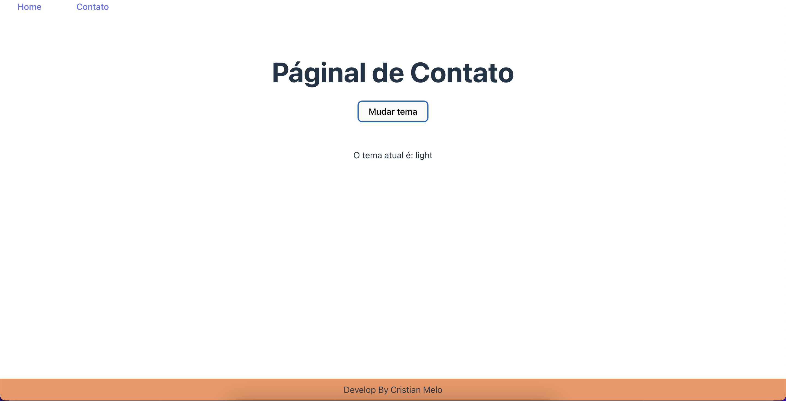
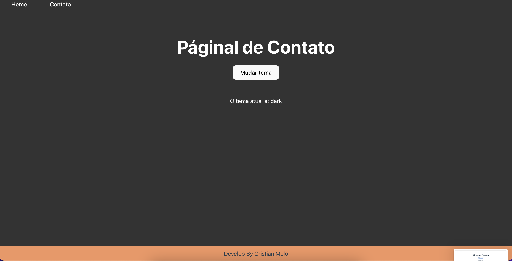

<!-- PROJECT LOGO -->
<div align="center">
  <a href="https://github.com/cristianmeelo/useContext-Theme-Switcher">
    
  </a>

<div align="left">
<br/>

<h1 id=readme-top> 📋 Briefing</h1>

</div>
<h3 align="center">USE CONTEXT - THEME SWITCHER</h3>

<p align="left">
  “UseContext” hook is used to create common data that can be accessed throughout the component hierarchy without passing the props down manually to each level. Context defined will be available to all the child components without involving “props”.
  The purpose of the application is to use and practice the useContext hook in a practical way, envisioning its benefits in the application when used with those responsible.
  <br />
  <p align="center">
    <a href="https://beta.reactjs.org/reference/react/useContext"><strong>Explore the official docs »</strong></a>
    <br />
  </p>

  </p>
</div>


<!--------- ABOUT THE PROJECT ----------->
<br/><br/><br/><br/><br/>

<h1> 📝 About The Project</h1>


<div align="center">
  
  
  
</div>

<p>
⬜️ Using useContext when changing classes in a lot of components (ok, in this project only 2), or changing themes, as you prefer, proves to be very efficient, since sharing props is very efficient.

🟧 In this project, when clicking on the main action button, the <code>toggleTheme</code> function is invoked. This function checks if the previous state of the variable, <code>theme</code>, initially set to "light", is identical to "light", if not, set <code>theme</code> to dark, if so, it remains in the light theme.

⬜️ That is, this function is responsible for switching the status of theme. Based on this variable, we handle className App using template string, varying between dark-theme in the css.
</p>

<div align="center">
<br />
<a href="https://use-context-theme-switcher.vercel.app/">View Demo</a>
·
<a href="https://github.com/cristianmeelo/useContext-Theme-Switcher/issues">Report Bug</a>
·
<a href="https://github.com/cristianmeelo/useContext-Theme-Switcher/issues">Request Feature</a>
·
<a href="https://stackblitz.com/edit/node-uhagjy?file=index.html">Acess in StackBlitz</a>


<br/><br/><br/><br/><br/>
<br/><br/><br/><br/><br/>

<p align="right">(<a href="#readme-top">back to top</a>)</p>
</div>


<h1> 🧰  Built With</h1>

<a href="https://vitejs.dev/"></a>

<a href="https://pt-br.reactjs.org/">
</a>

<a href="https://html.spec.whatwg.org/multipage/">
</a>

<a href="https://developer.mozilla.org/en-US/docs/Web/CSS">
</a>


<br/><br/><br/><br/><br/>
<br/><br/><br/><br/><br/>
<p align="right">(<a href="#readme-top">back to top</a>)</p>


<h1> 💻  Prerequisites</h1>

* npm
  ```sh
  npm install npm@latest -g
  ```

<br/><br/><br/><br/><br/>
<br/><br/><br/><br/><br/>
<p align="right">(<a href="#readme-top">back to top</a>)</p>

<h1> 📍  Installation</h1>

1. Clone the repo
   ```sh
   git clone https://github.com/cristianmeelo/useContext-Theme-Switcher.git
   ```
2. Install NPM packages
   ```sh
   npm install
   ```
3. Enter
   ```sh
   npm run dev
   ```
<br/><br/><br/><br/><br/>
<br/><br/><br/><br/><br/>
<p align="right">(<a href="#readme-top">back to top</a>)</p>


<!-- CONTACT -->


<h1> 📲 Contact</h1>


Linkedin - [in/cristian-melo](https://www.linkedin.com/in/cristian-melo/) - cristianmeelo@gmail.com

Project Link: [https://github.com/cristianmeelo/useContext-Theme-Switcher](https://github.com/cristianmeelo/useContext-Theme-Switcher)

<br/><br/><br/><br/><br/>
<br/><br/><br/><br/><br/>
<p align="right">(<a href="#readme-top">back to top</a>)</p>

